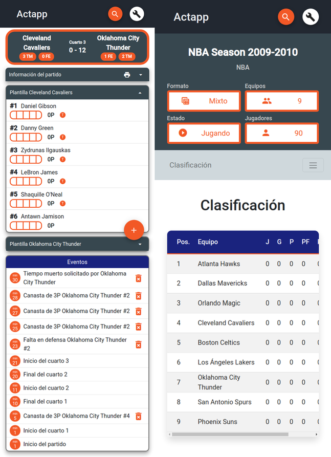
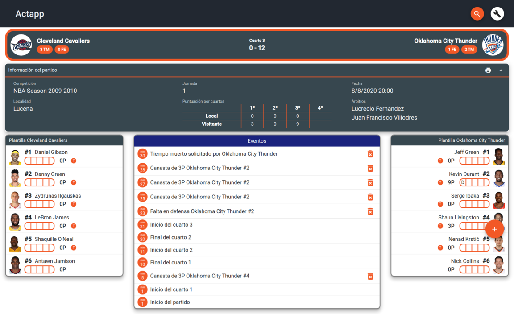

# Actapp - Basketball tournament manager 
### Computer Science Bachelor's Final Thesis - University of Granada, 2020
___

The main goal of this project is to design and develop a **web application for managing and displaying basketball
competitions** with a flexible approach, trying to avoid the current chaos we can find in our country (Spain)
about this sport:

- **Data and systems not shared between different federations**. Our country has a federation per Autonomous Community 
with private data and different ways to manage the same type of information. 
- **Unreadable referee game reports**. Unlike other sports such as football, the old format based on paper is very 
difficult to read unless you have technical knowledge of basketball. All events existing in a game for instance, the 
number of points a player has scored or faults that he/she committed are in a difficult paper format. 
- **It’s not user-friendly**. All information is difficult to understand, old fashion and with a poor user experience. 

This web application will help you to understand what happened or is happening in a game, see a digital version of the 
referee game report, being able to download a printable document of that report in a PDF file format. All existing 
information will be shown with a great user interface and awesome user experience, making them readable by everyone. 

In order to manage games, we need to manage competitions. So, this system will be flexible enough to take into account 
all possible needs we can find in a basketball game:

- **Competition mode**. You will be able to create a tournament taking into account all possible competition modes 
existing in this sport: league, cup or playoffs, and regular season and then playoffs. Thanks to the flexible approach, 
we can also set some competition configurations, like minimum number of players per team or number of games per playoff
round, among others. 
- **Number of players per game**. We need to be aware that basketball is a sport not tied to a specific number of 
players in each team, they must be equally but the number of players can vary. So, this platform will allow you to 
configure games with different number of players per team (5 on 5, 3 on 3, etc.). 

As consequence, this platform will also help you to manage players and teams that can participate in competitions, 
generate automatically all different fixtures for you, calculate standings of a league, display and set game schedules, 
view game results, and also, statistics based on a player, a team and players or teams in a specific competition, 
allowing you to follow some player or team development along years. 

All these features will be able to be displayed in **any device**. It doesn't matter the screen size of the device you 
are using, the content will be adapted either a personal computer, a tablet, a smartphone or even a TV. 

All the information existing in the system will be available and visible for everyone. However, all these events 
existing in a game will be logged by administrators thanks to a new accessible method of data input easy to use. The 
administrators are the only registered users existing in this application, and they are the only ones that can input 
data into the system. Administrators are also responsible for managing players, teams and competitions.

Also, data will always be updated, so you're able to view events that happened in a past game or what is happening **in 
live**.

## Architectural pattern

The chosen architectural pattern for this web application will be client-server model: it is a distributed pattern where
clients ask for utils to the different independent servers, which offers their services to other subsystems. Clients and
servers are communicated by a red.

This model holds a strong division between frontend and backend, improves the independence of designs and its 
cohesion, facilitates to reuse code, rise up the abstraction level, etc. Anyway, it isn't a common client-server model, 
as it is divided in 3 layers. This will help us to improve the scalability and the reliability of the application, among 
other benefits.

- **Presentation layer**: most superficial layer of the system. Displays the user interface and interact with him.
- **Prosecution layer**: keeps the set of rules that compose the business logic of the application. This layer is also 
divided in API, which receives the requests, and domain, which contains the business logic.
- **Database layer**: is the layer in charge of administration of the information inside the database.

## Database design

For its implementation, I decided to choose a document-oriented non-relational database technology like MongoDB. Due to 
that reason, it isn't possible to draw a common entity relationship diagram, but I will present an adapted version of
it.

We can find two types of relations between actors:
- **Relationships by reference**: we just keep the identifier of the document we want to reference. They are similar to 
the common relations we can find in a MySQL system. Will be indicated in the diagram with a blue line.
- **Relationships by embedded document**: in this kind of relationships, a full copy of the document we want to
reference is embedded in another one as a subdocument, giving us more flexibility. Will be represented with a red line.

## Frontend: Angular

Angular is an open-source frontend framework developed by Google for creating dynamic, modern web apps. Its election 
over other technologies is easy to understand: I have previous experience with it and its implementation would be 
painless as I imagined some sites would share components. Angular fits perfectly thanks to its component-based 
architecture, as we avoid duplicated code, make us easier its maintenance and improve code consistency. 

In addition to this framework, some other tools has been used:
- Angular material: implementation of Google's Material Design specification. Provides us some components and basic 
functionality.
- Bootstrap: kit of tools formed by a set of style sheets that help us to create websites.
- Lottie: animation library based on json objects rather than media files. This will reduce loading time.

## Backend: Node.js

Node.js is a JavaScript execution environment based on engine V8 by Google. This system compiles all the instructions to
native code, making things faster. It let us execute JavaScript code outside a web browser. It executes just one thread, 
deals request in asynchronous mode, and it's based on a non-blocking I/O event-guided architecture, which it's perfect 
for managing a large number of connections without blocking.

It has also been used by its NPM, its package manager which it's really popular. It offers a huge variety of tools that 
help us to make easier to develop the app.

## Screenshots

